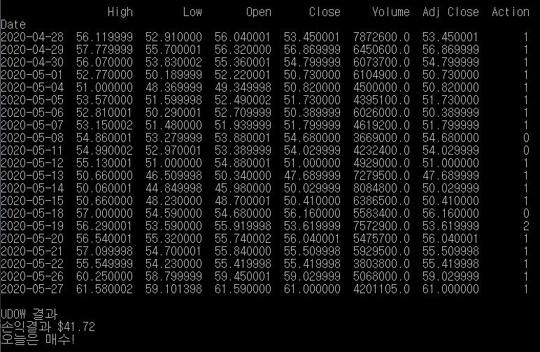
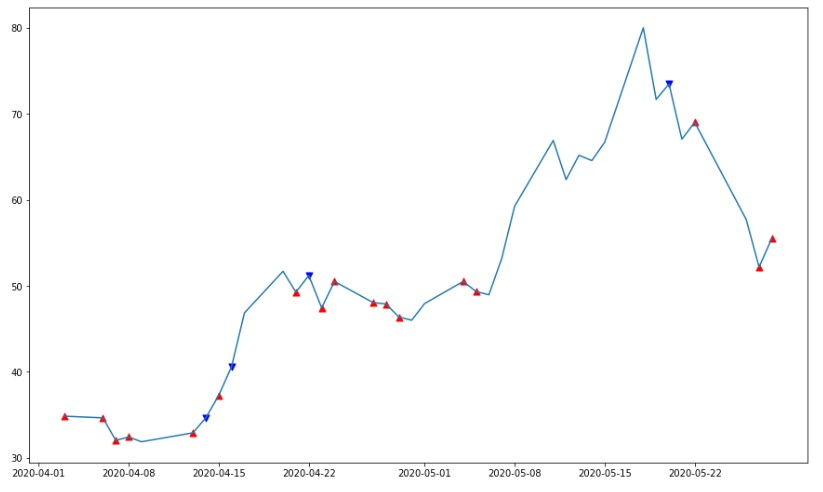

# RL_tradingbot
**강화학습**을 이용한 **주식 트레이딩 봇**

## 1. DQN
- (실행방법) python "1. DQN\bot_simple.py"
- 결과

## 2. A3C
- TODO

### 설치
 - PyTorch 설치
   - https://pytorch.org/get-started/locally 에 들어가서 본인 환경에 맞게 설치
   - Docker: https://hub.docker.com/r/pytorch/pytorch/
     - docker pull pytorch/pytorch
     - docker run -it pytorch/pytorch bash (기본설정)
     - docker run -it -p 5959:5959 pytorch/pytorch bash (Jupyter위한 포트설정)
     - docker run -it -p 5959:5959 -v d:/RL_tradingbot:/workspace/RL_tradingbot pytorch/pytorch bash (윈도우환경과 파일공유)
 - 기타 라이브러리 설치
   - pip install -r requirements.txt
 - (Optional) Jupyter Lab 실행
   - $ jupyter lab (LOCAL 컴퓨터에서)
   - $ jupyter lab --ip=0.0.0.0 --port=5959 --allow-root (도커에서)

 
